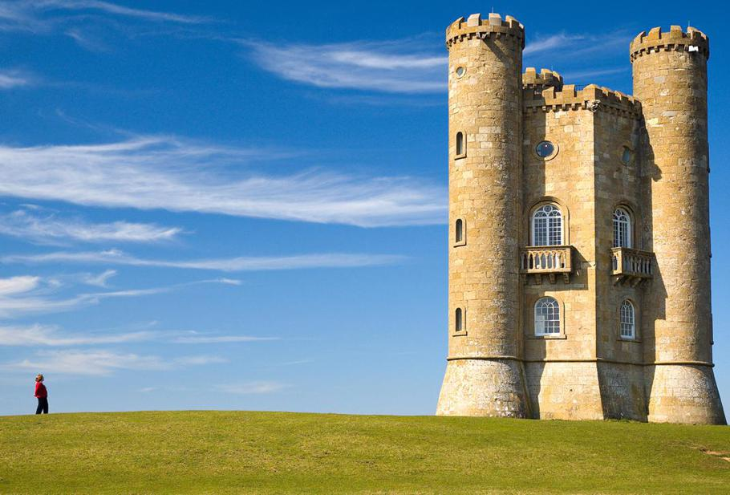
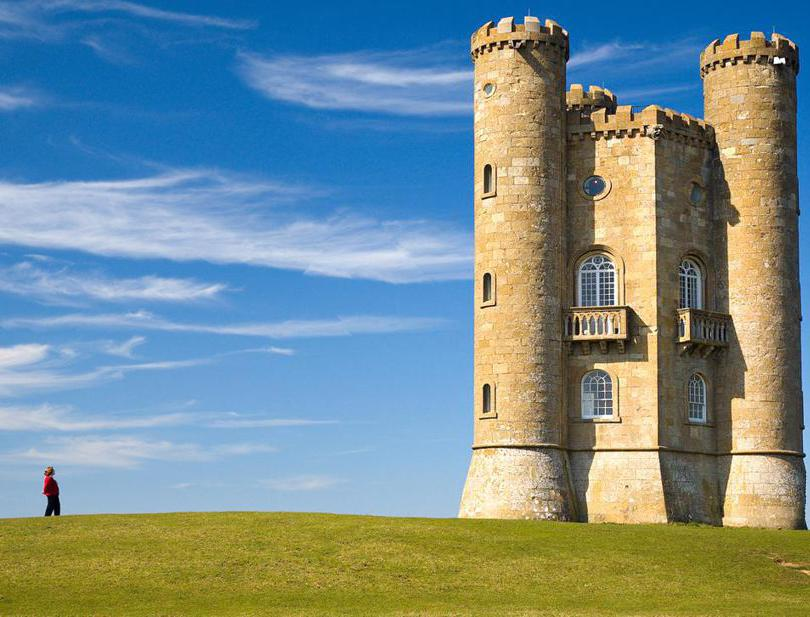

# Rippy

Seam carving is a process that allows you to resize an image while leaving the important parts unaltered.

The process entails repeatedly finding a path of pixels, or a seam, through an image that is relatively nondescript and then removing it. To find such a seam, we compute the energy at each pixel and then determine the path of smallest cumulative energy from one end of the image to the other.

The measure for energy that Rippy uses is simply the gradient magnitude.

## Features
At the moment, Rippy supports vertical seam removal, horizontal seam removal, or both. If both axes are chosen for removal, the vertical seams will be removed first (despite this being potentially suboptimal).

## Usage
`python3 rip.py [-h] -img IMG -out OUT [-vert VERT] [-horz HORZ]`

### Required Arguments:
- Input image path: `-img IMG`
- Output image path: `-out OUT`
### Optional Arguments:
- Show help message and exit: `-h` or `--help`
- Number of vertical seams to remove: `-vert VERT`
- Number of horizontal seams to remove: `-horz HORZ`

## Examples

### Vertical Seam Removal
###### Command:
`python3 rip.py -img img/broadway_tower.jpg -out img/broadway_tower_carved.jpg -vert 100`

###### Original Image:

###### Carving Process:

###### Resulting Image:

### Horizontal Seam Removal
###### Command:
`python3 rip.py -img img/corn.jpg -out img/corn_carved.jpg -horz 100`

###### Original Image:

###### Carving Process:

###### Resulting Image:

### Vertical and Horizontal Seam Removal
###### Command
`python3 rip.py -img img/moon.jpg -out img/moon_carved.jpg -vert 100 -horz 100`

###### Original Image:

###### Carving Process:

###### Resulting Image:

